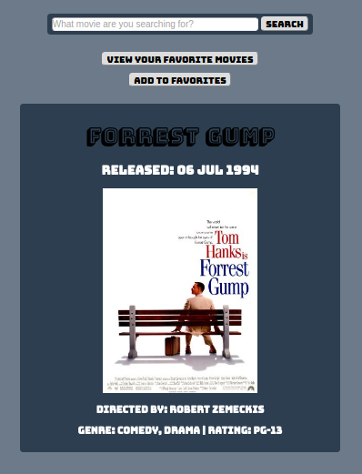

# ga-instructor-code-challenge

This project's front end was completed using Vanilla JS, XMLHttpRequest, HTML, and CSS.

The server code provided in Node.JS contained errors that I first corrected and provided
comments on how each error was corrected.

[OMDBapi](http://www.omdbapi.com/) 
is the external API used for the movie data.

##Movie Search

Here is a link to the deployed app on Heroku: http://ia-movie-searcher.herokuapp.com/

This single page app allows a user to search for any movie of his choice.

It will display the movies information including the title, director, rating, genre, and the movies poster.

If the user see's a movie that he/she likes, they can click a button to add it to their list of favorites.

Also, there is a button available that will show them their entire list of favorited movies.

If the user wishes to return and search for more movies, there is a button provided to return them to the search.

#### Here is a view of the single page app

### BONUS
I did not attempt the bonus due to time and other coding homework for class.

But, I thought I would take a short moment to explain the benefits and any additions challenges
students would face learning an MVC library.

##### Challenges
Obviously learning something new is always going to be difficult at first.

This could require learning whole new languages such as Mongo and Angular.
Also learning new node packages that offer different functionality to the app.

These packages could include but are not limited to Handlebars, Mongoose, Passport, etc.

##### Benefits

With those languages comes better functionality and cleaner code.

You can seperate concerns of different controllers, clean up your HTML views, and DRY up your code.

Understandable and readable by others.
